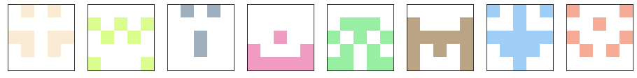
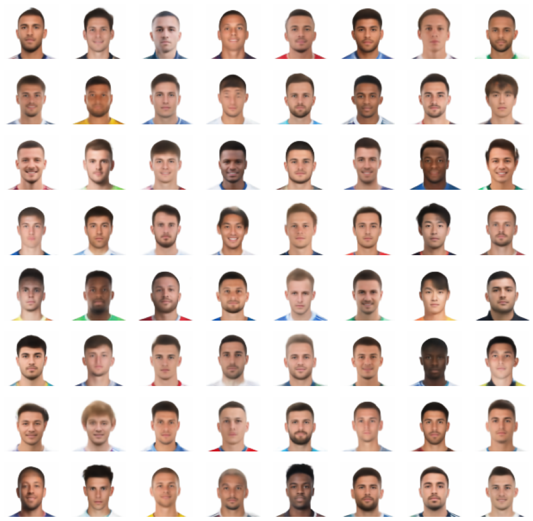

# avatar-generator
Generate different types of random avatars.

## Requirements

Python3
pytorch>=1.6
cv2>=3.4
tqdm

## 1. Github-like avatars



Run the following line to generate png files, where 10 represents 10 output avatars, and 96 represents the size of images.

```
python generate_githublike.py ./examples/avatars_githublike/ 10 96
```

## 2. Young Male Athletes



These avators are generated by the decoder of a pretrained variational auto-encoder model. Run the following line to generate png files, where 10 represents 10 output avatars, and 96 represents the size of images.

```
python generate_athletes.py ./examples/avatars_athletes/ 10 96
```
