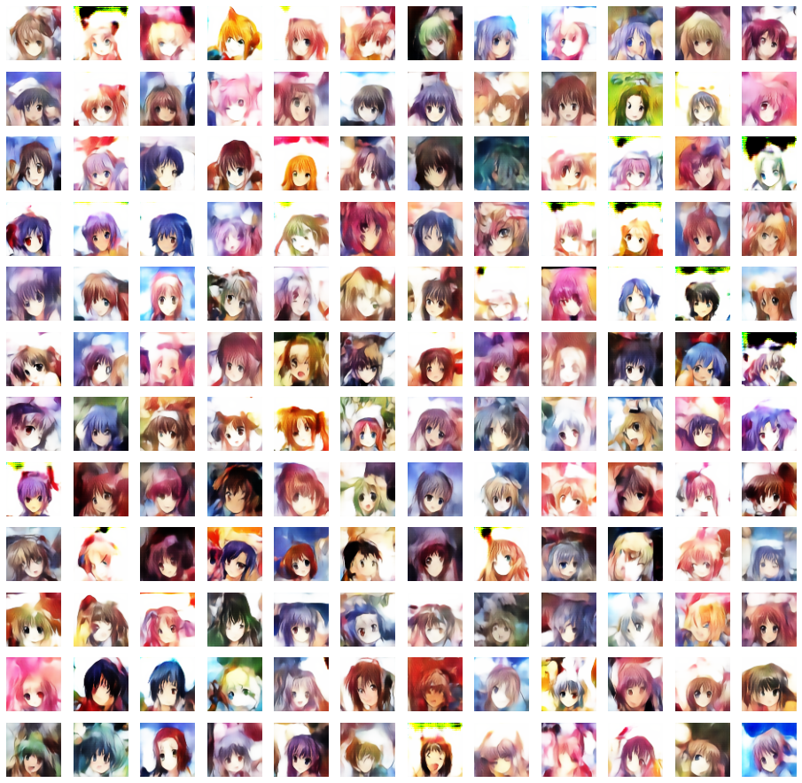

# avatar-generator
Generate different types of random avatars.

## Requirements

Python3

pytorch>=1.6

cv2>=3.4

tqdm

## 0. Download Pretrained Models

Please download the pretrained models from:

```
https://drive.google.com/drive/folders/1J_99la18a2ZeIBEPQ2_xqFa_uOxkrZVI?usp=sharing
```

and put the files under the "models" folder. The filetree should look like:

```
models
  |-avatar_02_ae_07_decoder.pth
  |-avatar_02_ae_07.npy
  |-avatar_04_cartoon_face_02_decoder.pth
  |-avatar_04_cartoon_face_02.npy
```

## 1. Github-like avatars


Run the following line to generate png files, where 10 represents 10 output avatars, and 96 represents the size of images are 96*96.

```
python generate_githublike.py ./examples/avatars_githublike/ 10 96
```

## 2. Young Male Athletes


These avators are generated by the decoder of a pretrained variational auto-encoder model. Run the following line to generate png files, where 10 represents 10 output avatars, and 96 represents the size of images are 96*96.

```
python generate_athletes.py ./examples/avatars_athletes/ 10 96
```


## 3. Anime



These avators are generated by the generator of a pretrained generative adversarial network (GAN) model. Run the following line to generate png files, where 10 represents 10 output avatars, and 96 represents the size of images are 96*96.

```
python generate_anime.py ./examples/avatars_anime/ 10 96
```
